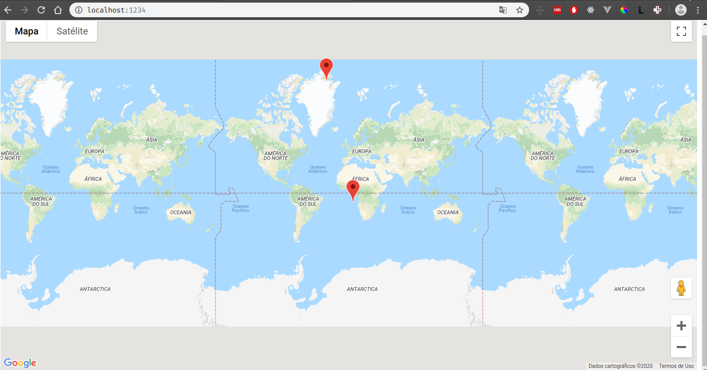
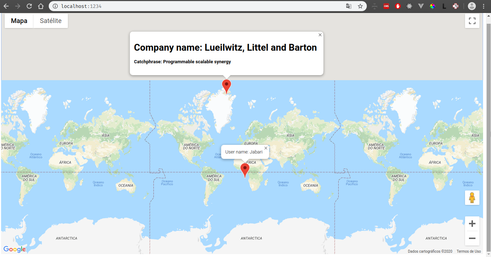

# Criando marcadores no Google Map utilizando Typescript

Os marcadores são criados aleatóriamente utilizando a biblioteca faker. Dois tipos de usuário, User e Company, com detalhes de informações diferentes para mostrar na tela ao clicar no 'marker'.

O projeto é executado a partir da biblioteca parcel.
